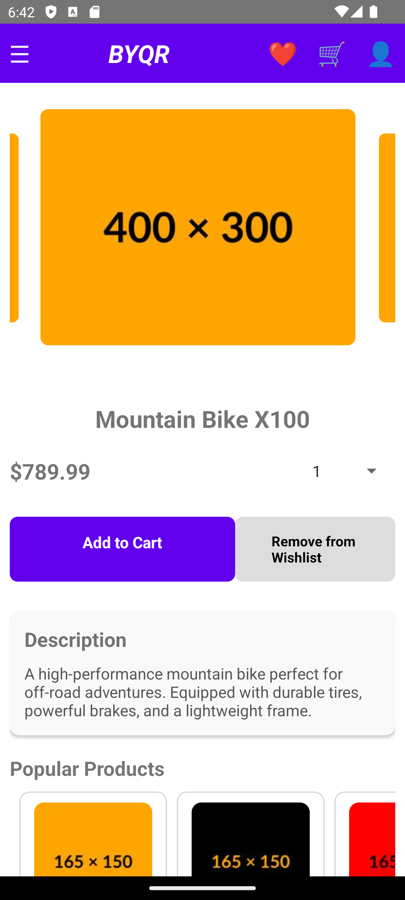

# BYQR - Eco-Conscious & Health-Conscious Marketplace

**BYQR** is a mobile application built using React Native for eco-conscious and health-conscious individuals to buy bicycles and related equipment such as gloves, biker shorts, helmets, water bottles, and universal attachments for bicycles.

---

## v1.0.0 - Current Features

### Screens & User Flow
1. **Login Screen**:
   - Allows users to sign in and access full functionality.
2. **Home Screen**:
   - View products with filtering options (e.g., categories: bicycles and accessories).
   - Accessible to all users (authenticated and unauthenticated).
3. **Product Description Screen**:
   - View product details like name, price, description and images.
   - Also fully accessible to unauthenticated users.
4. **Cart Screen**:
   - Authenticated users can add products (up to 4 quantities per product) to their cart.
   - Move products freely between cart and wishlist.
5. **Wishlist Screen**:
   - Save desired products to wishlist for future reference.
6. **Profile Screen**:
   - View and manage user information.

### Key Functionalities
- **Guest Access**:
   - Home and Product Description screens are accessible without authentication.
- **Authentication**:
   - Sign-in required to add products to cart or wishlist.
- **Cart Management**:
   - Add products to cart (limit: 4 per product).
   - Move products between cart and wishlist.
- **Admin Interface**:
   - A separate web app allows admins to create, edit, or delete product entries.
   - Admin role verified via backend middleware.
   - Link: [BYQR Admin Interface Repo](https://github.com/Illuminatus66/byqr_admin.git)

---

## Technology Stack

### Frontend
- **TypeScript** with **React Native** (No usage of Expo or any other frameworks).

### Backend
- **JavaScript** with **Node.js** and **Express.js**.
- Unified backend serves both mobile app and admin interface.
- Backend hosted on **Heroku**.

### Database
- **MongoDB Atlas**: Stores user data and product data that is textual in nature.
- **AWS S3**: Stores product images.

### Admin Interface (Web App)
- Built with **React**.
- Hosted on **Netlify**.

---

## Future Development (v2.0.0)

### Planned Features
1. **Search Functionality**:
   - Add a direct search functionality in addition to the existing filtering feature.
2. **Payment Integration**:
   - Implement platforms like **Stripe** to enable purchases.
3. **Order Management**:
   - Allow users to manage and track their orders.
4. **QR Code Deep Linking**:
   - Generate QR codes for bicycles.
   - Scanning the code redirects to the product description page in the app. If the app is not installed, redirect users to to project's GitHub page.
5. **Product Comparison**:
   - Compare 2-3 similar products (e.g., bicycles with bicycles).
6. **Admin Analytics Dashboard**:
   - Integrate analytics for admins to monitor user visits to product pages, order frequencies, and other user activity.

---

## Installation & Setup Instructions

### Prerequisites
- **Node.js** installed on your system.
- **JDK** preferably JDK-17 installed on your system
- **Android Studio** for running the app on an Android emulator.
- You can also follow this guide on how to [set up the development environment](https://reactnative.dev/docs/set-up-your-environment)

### Run the Mobile App

#### 1. Clone the Repository
```bash
$ git clone https://github.com/Illuminatus66/byqr.git
$ cd byqr
```

#### 2. Install Dependencies
```bash
$ npm install
```

#### 3. Android Setup
- Open **Android Studio** and set up the development environment as detailed in the [guide](https://reactnative.dev/docs/set-up-your-environment) .
- Start the Metro Bundler in one terminal
```bash
$ npm start
```
- Run the app in another terminal:
```bash
$ react-native run-android
```
You should now see the app being installed in an emulated Android device.

#### 4. iOS Setup
- Install **Xcode** and CocoaPods.
- Navigate to the iOS folder:
```bash
$ cd ios
$ pod install
$ cd ..
```
- Run the app:
```bash
$ npx react-native run-ios
```

---

## Admin Interface Setup (Optional)
If you wish to set up the admin interface locally:

### Prerequisites
- **Node.js** and **npm**.

### Steps
1. Clone the repository:
```bash
$ git clone https://github.com/yourusername/byqr_admin.git
$ cd byqr_admin
```
2. Install dependencies:
```bash
$ npm install
```
3. Change the Base URL in the API folder to the URL for your server
```
const API = axios.create({
  baseURL: "https://yourbaseURL/",
});
```
4. Start the app:
```bash
$ npm start
```

---

## How to Use
1. Run the mobile application on an Android device/emulator.
2. Sign up or log in to access cart and wishlist functionalities.
3. Explore products, filter items, and move products between cart and wishlist.

---

## Screenshots

### Home Screen


### Cart Screen


### Product Description Screen


### Wishlist Screen


### Profile Screen


---

## Contributing
Contributions are welcome! If you'd like to improve the app, open an issue or submit a pull request.
Built with ❤️ for eco-conscious and health-conscious communities.
